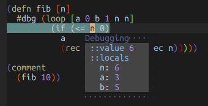

== Debugging [[debugging]]

vim-iced supports CIDER's https://docs.cider.mx/cider/debugging/debugger.html[#dbg and #break] reader literals.
The easiest way is to put `#dbg` to your code, and evaluate it.

[source,clojure]
----
(defn fib [n]
  #dbg (loop [a 0 b 1 n n]
         (if (<= n 0)
           a
           (recur b (+ a b) (dec n)))))
----

Once you evaluate `(fib 10)`, debugger will launched something like follows.

// Related options:
// - |g:iced#debug#value_max_length|

=== Tracing function calls

//TRACING FUNCTION CALLS              *vim-iced-debugging-tracing-function-calls*
//
//  vim-iced provides 2 ways for tracing function calls.
//  - |:IcedToggleTraceVar|
//  - |:IcedToggleTraceNs|
//
//  Traced result will be displayed in stdout buffer.
//  - |vim-iced-stdout-buffer|

=== Browsing tapped values

//BROWSING TAPPED VALUES              *vim-iced-debugging-browsing-tapped-values*
//
//  WARNING: To use `tap>`, Clojure 1.10.0 or later is required
//
//  If you have a big data structure and want to dig into it,
//  browsing tapped values is useful.
//
//  When you evaluate `(tap> YOUR_DATA)`, |:IcedBrowseTapped| shows tapped values.
//  Select the value you want to dig into, then browsing value start.
//  See |:IcedBrowseTapped| for browsing key details.
//
//  All tapped values are stored in memory.
//  So if you would like to delete them, execute |:IcedClearTapped| command.
